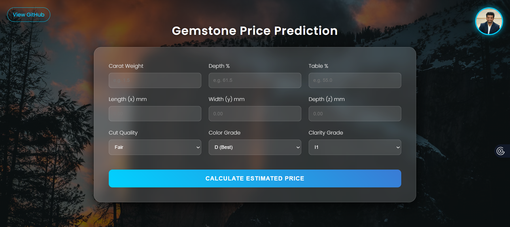
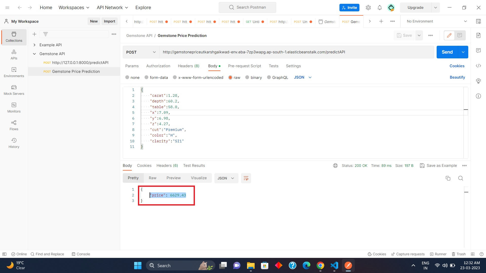

# Gemstone Price Prediction - Harsh Tadha

### Introduction About the Data :

Please this project is of a student. Just wanted to appreciate for knowledge sharing 

**The dataset** The goal is to predict `price` of given diamond (Regression Analysis).

There are 10 independent variables (including `id`):

* `id` : unique identifier of each diamond
* `carat` : Carat (ct.) refers to the unique unit of weight measurement used exclusively to weigh gemstones and diamonds.
* `cut` : Quality of Diamond Cut
* `color` : Color of Diamond
* `clarity` : Diamond clarity is a measure of the purity and rarity of the stone, graded by the visibility of these characteristics under 10-power magnification.
* `depth` : The depth of diamond is its height (in millimeters) measured from the culet (bottom tip) to the table (flat, top surface)
* `table` : A diamond's table is the facet which can be seen when the stone is viewed face up.
* `x` : Diamond X dimension
* `y` : Diamond Y dimension
* `x` : Diamond Z dimension

Target variable:
* `price`: Price of the given Diamond.

Dataset Source Link :
[https://www.kaggle.com/competitions/playground-series-s3e8/data?select=train.csv](https://www.kaggle.com/competitions/playground-series-s3e8/data?select=train.csv)

### It is observed that the categorical variables 'cut', 'color' and 'clarity' are ordinal in nature

### Check this link for details : [American Gem Society](https://www.americangemsociety.org/ags-diamond-grading-system/)

---

# Setup & Installation Guide

Follow these step-by-step instructions to set up and run the project locally.

## Prerequisites
- Python 3.8 or higher installed on your system
- pip (Python package manager)
- Git (optional, for cloning the repository)

## Step-by-Step Installation

### Step 1: Clone or Download the Project
```bash
git clone https://github.com/your-repo/Gemstone-Price-Prediction.git
cd Gemstone-Price-Prediction-main
```
Or download and extract the project folder manually.

### Step 2: Create Virtual Environment
Open PowerShell and navigate to the project directory, then run:
```powershell
python -m venv venv
```
This creates a virtual environment folder named `venv`.

### Step 3: Activate Virtual Environment
```powershell
.\venv\Scripts\Activate.ps1
```
**Note:** If you get an execution policy error, run this first:
```powershell
Set-ExecutionPolicy -ExecutionPolicy RemoteSigned -Scope CurrentUser
```

You should see `(venv)` prefix in your PowerShell prompt after activation.

### Step 4: Upgrade pip
```powershell
python -m pip install --upgrade pip
```

### Step 5: Install Required Dependencies
```powershell
pip install -r requirements.txt
```
This installs all necessary packages: numpy, pandas, scikit-learn, catboost, xgboost, flask, and more.

### Step 6: Run the Flask Application
```powershell
python application.py
```

### Step 7: Access the Web Application
Open your web browser and navigate to:
```
http://localhost:5000
```
or
```
http://127.0.0.1:5000
```

## Using the Application

1. **Fill in the Form:** Enter gemstone characteristics:
   - Carat (weight of the gemstone)
   - Depth (height in millimeters)
   - Table (facet width)
   - X, Y, Z dimensions
   - Cut (quality of cut)
   - Color of gemstone
   - Clarity grade

2. **Get Prediction:** Click the predict button to get the estimated price.

3. **API Usage:** You can also use the `/predictAPI` endpoint by sending a POST request with JSON data:
```bash
curl -X POST http://localhost:5000/predictAPI \
  -H "Content-Type: application/json" \
  -d '{"carat": 0.5, "depth": 60, "table": 55, "x": 5, "y": 5, "z": 3, "cut": "Good", "color": "E", "clarity": "SI1"}'
```

## Deactivate Virtual Environment (When Done)
```powershell
deactivate
```

---

# AWS Deployment Link :

AWS Elastic Beanstalk link : [http://gemstonepriceutkarshgaikwad-env.eba-7zp3wapg.ap-south-1.elasticbeanstalk.com/](http://gemstonepriceutkarshgaikwad-env.eba-7zp3wapg.ap-south-1.elasticbeanstalk.com/)

# Screenshot of UI





# AWS API Link

API Link : [http://gemstonepriceutkarshgaikwad-env.eba-7zp3wapg.ap-south-1.elasticbeanstalk.com/predictAPI](http://gemstonepriceutkarshgaikwad-env.eba-7zp3wapg.ap-south-1.elasticbeanstalk.com/predictAPI)

# Postman Testing of API :


# Approach for the project 

1. Data Ingestion : 
    * In Data Ingestion phase the data is first read as csv. 
    * Then the data is split into training and testing and saved as csv file.

2. Data Transformation : 
    * In this phase a ColumnTransformer Pipeline is created.
    * for Numeric Variables first SimpleImputer is applied with strategy median , then Standard Scaling is performed on numeric data.
    * for Categorical Variables SimpleImputer is applied with most frequent strategy, then ordinal encoding performed , after this data is scaled with Standard Scaler.
    * This preprocessor is saved as pickle file.

3. Model Training : 
    * In this phase base model is tested . The best model found was catboost regressor.
    * After this hyperparameter tuning is performed on catboost and knn model.
    * A final VotingRegressor is created which will combine prediction of catboost, xgboost and knn models.
    * This model is saved as pickle file.

4. Prediction Pipeline : 
    * This pipeline converts given data into dataframe and has various functions to load pickle files and predict the final results in python.

5. Flask App creation : 
    * Flask app is created with User Interface to predict the gemstone prices inside a Web Application.

# Exploratory Data Analysis Notebook

Link : [EDA Notebook](./notebook/1_EDA_Gemstone_price.ipynb)

# Model Training Approach Notebook

Link : [Model Training Notebook](./notebook/2_Model_Training_Gemstone.ipynb)

# Model Interpretation with LIME 

Link : [LIME Interpretation](./notebook/3_Explainability_with_LIME.ipynb)
